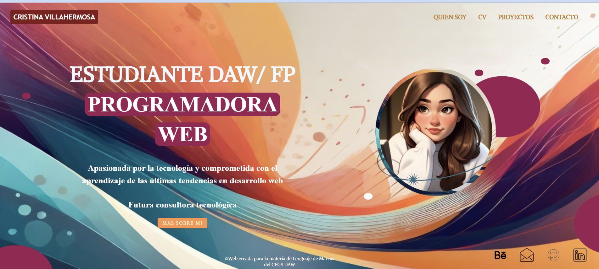

# 🌐 Landing Page Personal - Cristina Villahermosa

Este proyecto es una landing page responsive desarrollada como práctica final de la materia **Lenguaje de Marcas** del CFGS **Desarrollo de Aplicaciones Web (DAW)**.

## 🧠 Sobre mí

Soy estudiante de DAW, apasionada por la tecnología y el desarrollo web. Esta página es un ejemplo visual de mi perfil profesional y creativo.

## ✨ Tecnologías utilizadas

- HTML5
- CSS3
- Responsive Design con media queries
- Fuentes personalizadas y uso de FontAwesome

## 📸 Capturas

